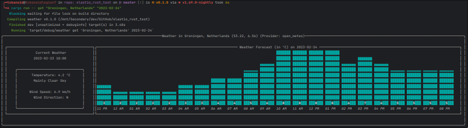
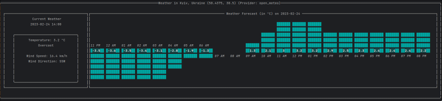
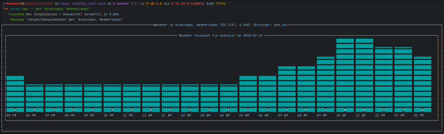
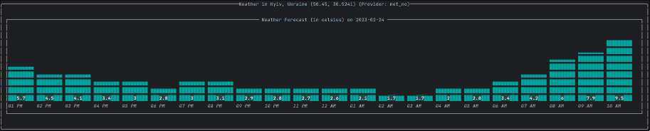

# elastio_rust_test_weather
Test Task for a job submission to Elastio

# Usage
```bash
weather configure <provider_name> # Set a new provider in a config file
cargo run -- configure <provider_name> # While developing
weather get <address> [date="now"] # Get weather forecast (or historical data) (and potentially current weather conditions) for requested address and time
cargo run -- get <address> [date="now"] # While developing
```

# Example
### With open_meteo provider
#### Weather in Groningen, Netherlands on 2023-02-24
```bash
cargo run -- get "Groningen, Netherlands" "2023-02-24"
```


#### Weather in Kyiv, Ukraine, current date
```bash
cargo run -- get "Kyiv, Ukraine"
```


### With met_no provider
#### Weather in Groningen, Netherlands, current date
```bash
cargo run -- get "Groningen, Netherlands"
```


#### Weather in Kyiv, Ukraine, current date
```bash
cargo run -- get "Kyiv, Ukraine"
```


## FAQ:
<b>Q</b>: Which providers are available? </br>
<b>A</b>: [open_meteo](https://open-meteo.com) (supports current conditions, forecast & history data, custom dates) 
          & [met_no](https://api.met.no/weatherapi/locationforecast/2.0/documentation) (only forecast, no custom dates)

<b>Q</b>: Why only 2 providers and why specifically those 2? </br>
<b>A</b>: They are free and don't require giving my bank account information to get an API key.
          I'm also not familiar with best practices of storing secret API key in a public repo, so I didn't want to risk it.
          To answer why there is only 2 of them and not more: It's very hard to find a completely free API that provides all
          the needed data for ideal experience with the app, so I decided to go with the minimum.

<b>Q</b>: Is there a config file for the app? </br>
<b>A</b>: Yes, it should be created automatically on the first run with "open_meteo" as the default provider located in "{config_dir}/weather/config.json" (Check https://docs.rs/dirs/latest/dirs/fn.config_dir.html)

<b>Q</b>: What are the acceptable values for the address? </br>
<b>A</b>: Address can either be an actual address written in English or a "{lat},{lon}" pair,
I use [geocoding](https://docs.rs/geocoding/latest/geocoding/) crate under the hood to get the lat,long from address and address from lon,lat (api requirement) for ui display

<b>Q</b>: What are the acceptable values for the date? </br>
<b>A</b>: Date can be either "now" or a date in the format, supported by [dateparser](https://docs.rs/dateparser/latest/dateparser/)

<b>Q</b>: How do you parse the cli args? </br>
<b>A</b>: I use [clap](https://docs.rs/clap/latest/clap/) crate for that and utilize it's derive API

<b>Q</b> What do you use to draw the data on the screen? </br>
<b>A</b>: I use [tui-rs](https://docs.rs/tui/latest/tui/) crate for that

<b>Q</b>: UI is weird/ugly, why? </br>
<b>A</b>: I'm not a designer, have a limited tui-rs experience and the library itself is quite limited on customization 
          front, that's the best I can do with it in this short amount of time.

<b>Q</b>: What is this weird [built](https://docs.rs/built/latest/built/) dependency you have and why do you use it? </br>
<b>A</b>: It's a crate that allows you to get the build info for the app and I use it to accurately create the config dir 
          based on the name of the package (which in the long run can reduce the headache of having to replace the name 
          in multiple places/files in case I decide to rename the package if I want to continue working on it)

<b>Q</b>: Why no test cases? </br>
<b>A</b>: I'm not new to cargos unit testing framework, but I'm still not very efficient with writing appropriate test 
          cases and I just didn't want to spend too much time dealing with it. + I tested the application myself
          with different inputs, and it worked as expected, if the arguments where correct, and shown right errors when 
          they weren't. It is definitely possible that I could've missed something, but as I said, I didn't want to spend 
          too much time testing a relatively simple CLI tool, which is suppoed to just be a prototype anyway.
